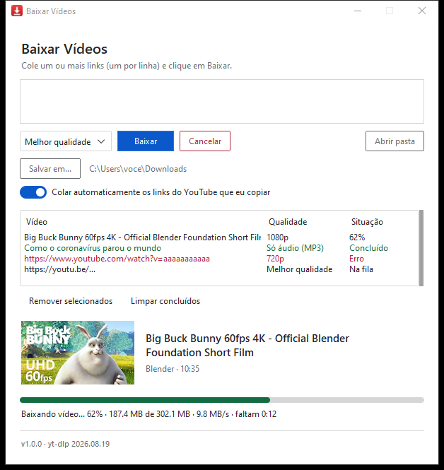

<p align="center">
  
</p>

<h1 align="center">Baixar Vídeos</h1>

<p align="center">
  Aplicativo para Windows que baixa vídeos do YouTube, com fila de downloads,<br>
  escolha de qualidade e opção de baixar só o áudio em MP3.
</p>

<p align="center">
  <a href="https://github.com/Brunera17/Baixar-videos/releases/latest"><b>⬇ Baixar o instalador</b></a>
</p>

<p align="center">
  
</p>

## Funcionalidades

- **Fila de downloads**: cole um ou vários links e eles são baixados um depois do outro
- **Qualidade**: melhor disponível (até 4K), 1080p, 720p, 480p, 360p ou **só áudio (MP3)**
- **Acompanhamento**: miniatura, título, velocidade, tamanho e tempo restante
- **Cancelar** o vídeo atual sem parar a fila; os arquivos incompletos são apagados
- **Salvar em...**: escolha a pasta de destino (o app lembra a última)
- **Colar automático**: os links do YouTube que você copiar aparecem sozinhos no app
- **Mensagens claras** quando algo dá errado (link inválido, vídeo privado, sem internet…)
- **yt-dlp sempre em dia**: o app avisa quando sai uma versão nova e atualiza com um clique
- **Tema claro ou escuro**, seguindo o Windows

## Instalação

1. Baixe o **`BaixarVideos-Instalador-x.y.z.exe`** na [página de releases](https://github.com/Brunera17/Baixar-videos/releases/latest).
2. Dê dois cliques no arquivo.
3. Se aparecer **"O Windows protegeu o computador"**, clique em **Mais informações** → **Executar assim mesmo**.
   O aviso aparece porque o instalador não tem assinatura digital (que exige um certificado pago).
4. Clique em **Avançar** até o fim.

O app fica no **menu Iniciar** e na **área de trabalho**. Não precisa de permissão de administrador
nem de instalar mais nada: Python, ffmpeg e o resto já vão junto.

**Requisitos:** Windows 10 ou 11, 64 bits.

> Algum antivírus pode reclamar do instalador sem motivo real, o que é comum com programas feitos em Python.
> Se acontecer, dá para enviar o arquivo para análise no site do antivírus.

**Atualizar:** rode o instalador da versão nova por cima.
**Desinstalar:** Configurações → Aplicativos → Baixar Vídeos. As preferências ficam guardadas caso você reinstale.

## Como usar

1. Copie o link do vídeo no navegador e volte para o app: o link já aparece na caixa
   (ou cole você mesmo, um por linha).
2. Escolha a qualidade e, se quiser, a pasta em **Salvar em...**.
3. Clique em **Baixar** (ou `Ctrl+Enter`).

Os arquivos vão para a pasta **Downloads** do Windows, a menos que você escolha outra.
Clicar em um item da fila com erro mostra o motivo.

## Para desenvolvedores

### Rodar pelo código

Precisa de **Python 3.10 ou mais novo**.

```bash
python -m venv venv
venv\Scripts\activate
pip install -r requirements.txt
python app.py
```

### Gerar o executável e o instalador

| Comando | Resultado |
|---|---|
| `build.bat` | `dist\BaixarVideos.exe`: arquivo único e portátil |
| `build.bat instalador` | `instalador\saida\BaixarVideos-Instalador-<versão>.exe` |

O instalador precisa do [Inno Setup 6](https://jrsoftware.org/isinfo.php)
(`winget install JRSoftware.InnoSetup`). Nele o app vai como pasta em vez de arquivo único,
o que o faz abrir em ~0,5 s em vez de ~3 s.

**Nova versão:** mude `VERSAO_APP` no `app.py`, rode `build.bat instalador` e publique o instalador
numa nova release.

### Estrutura

| Caminho | O que é |
|---|---|
| `app.py` | O app inteiro: download (yt-dlp), fila, interface (ttkbootstrap), atualização do yt-dlp |
| `build.bat` | Gera o `.exe` portátil ou o instalador |
| `instalador/BaixarVideos.iss` | Script do Inno Setup (atalhos, desinstalador, etc.) |
| `assets/` | Ícone do app (vai junto no executável) |
| `ferramentas/gerar_icone.py` | Recria o ícone a partir do desenho em código |
| `ferramentas/versao.py` | Lê `VERSAO_APP` para o `build.bat` |
| `docs/` | Imagens deste README |

### Como funciona por dentro

- **[yt-dlp](https://github.com/yt-dlp/yt-dlp)** faz o download. O YouTube entrega vídeo e áudio separados,
  e o **ffmpeg** (do pacote `imageio-ffmpeg`) junta os dois ou converte para MP3.
- O **[Deno](https://deno.com)** vai embutido para o yt-dlp resolver o JavaScript do YouTube, sem exigir Node.js no PC.
- O botão **Atualizar** baixa o yt-dlp novo do PyPI (conferindo o SHA-256) para
  `%APPDATA%\BaixarVideos\atualizacoes`, que tem prioridade sobre a versão embutida. Se a atualização não
  carregar, o app volta para a embutida.
- Preferências e log de erros ficam em `%APPDATA%\BaixarVideos` (`config.json` e `erros.log`).

## Uso responsável

Os termos de uso do YouTube só permitem baixar vídeos quando o próprio YouTube oferece essa opção
ou com autorização de quem publicou. Use para vídeos seus ou que você tenha permissão para baixar.

---

A imagem de exemplo mostra *Big Buck Bunny*, © Blender Foundation, licenciado sob
[CC BY 3.0](https://creativecommons.org/licenses/by/3.0/).
